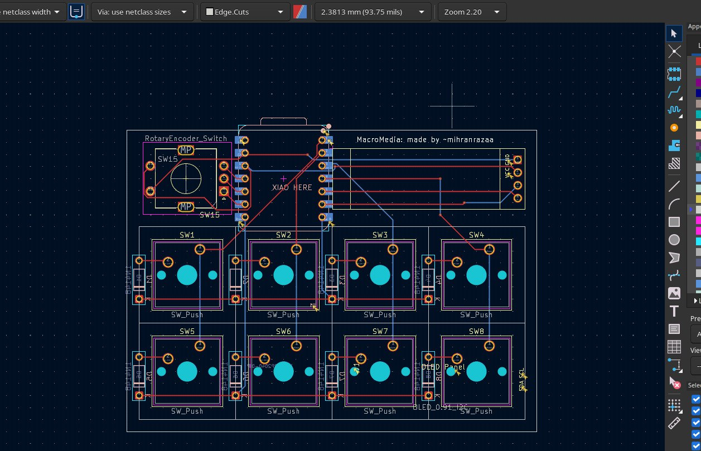
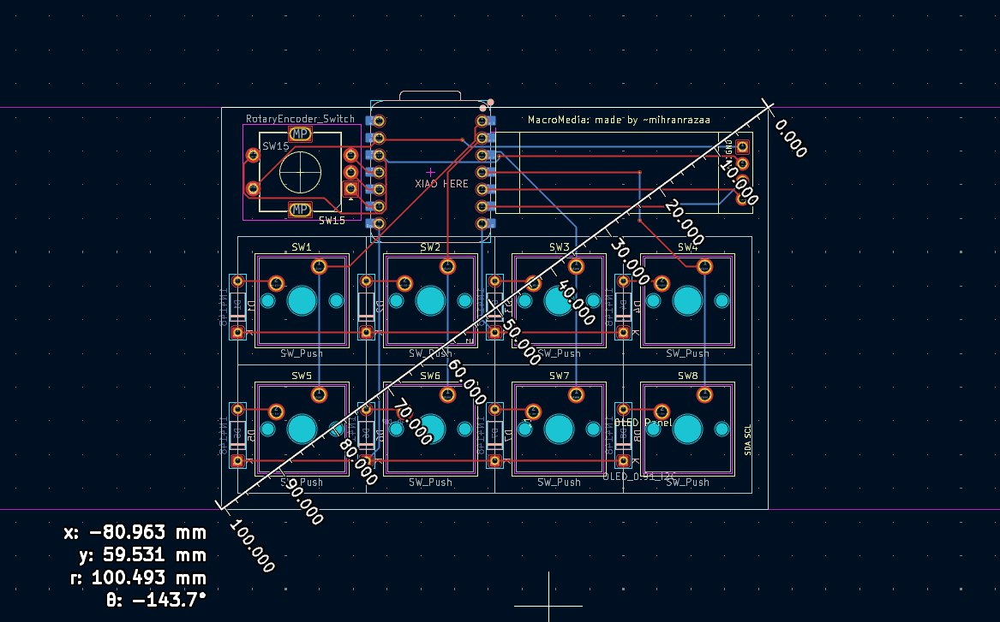
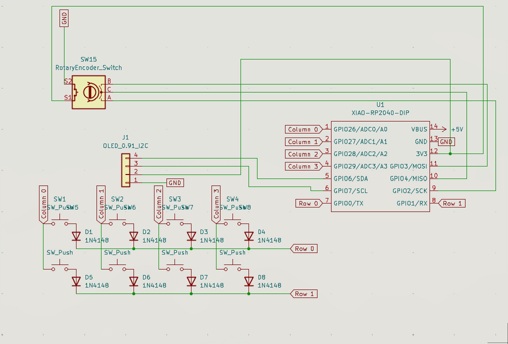
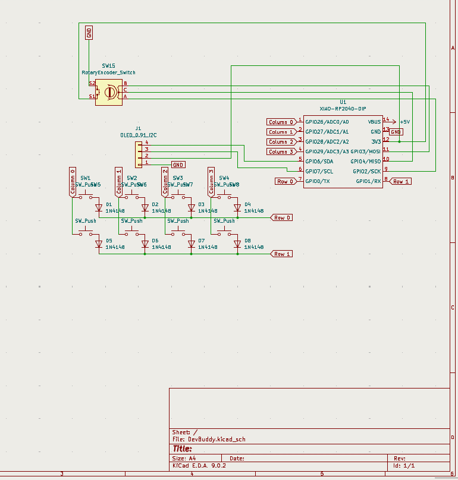
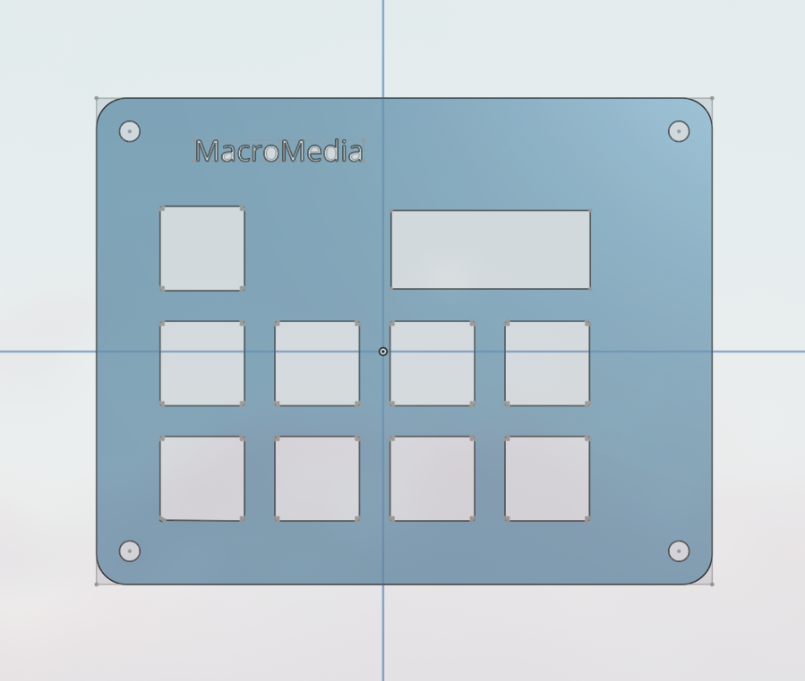
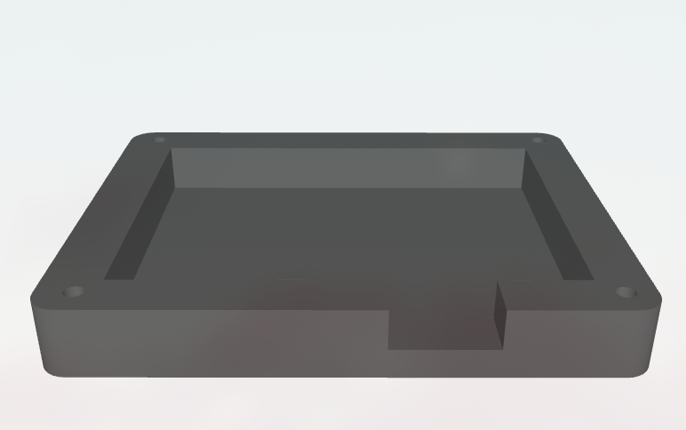
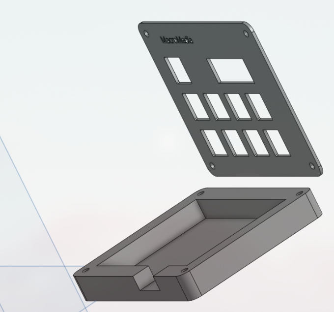
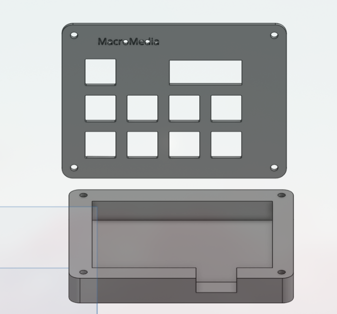

# MacroMedia(HackPad)

## Introduction

Hello viewers this project was created by watching and learning how to make a macropad by [Hackpad](https://hackpad.hackclub.com/) , An event organised by [Hackclub](https://hackclub.com/). With the teachings i created **MacroMedia** which controls all your media with just one click, based on XIAO RP2040 MCU. Enjoy :)

## Extra Stuff

### Gratitude
- Thanks to Hackclub and Hackpad for making me do this brilliant project, More coming :).
- Thanks to my potato for helping me till the end.
- Thanks to myself for completing the project and not getting distracted with another project.
- And Thank you for Reading?

### Challenges
Never thought i would rage quite while i'm building something interesting, my potato(Yeah that's the name of my laptop) was like a heater when i was using CAD Software, i literally tried 5 software checking which worked the smoothest and none worked then shifted too browser based onshape tool which at the end atleast worked properly. Time to change my potato 😂

---
## Inner-Workings

### Specifications
####  BOM
- 1x XIAO RP2040
- 1x 0.91 inch OLED displays
- 8x Through-hole 1N4148 Diodes
- 8x Blank DSA keycaps
- 1x EC11 Rotary encoders
- 8x MX-Style switches
- 4x M3x16 Bolt
- 4x M3 Heatset

#### Others
- KMK Firmware
- Plate.stl
- Body.stl

---
## Images

### Schematics and PCB Design

---

---
### 3D Printed Case
Plate:

---

Body :

---

Both :

**I wasn't able to merge them together my potato laptop was already lagging too much and taking away all my time. Hope you understand. Dimensions have been checked.**
(If need a video of me building this 3D model you ask me, it's quite funny lol. )

---

BYEEEEE
Check my [Blog](https://mihranrazaa.pages.dev/) 
~ mihranrazaa
